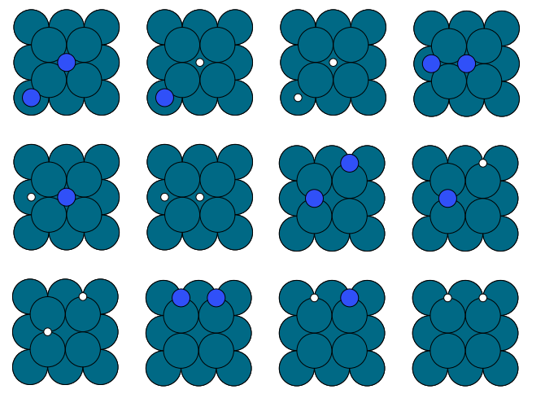

# Materials Interface
## Authors

- Ryther Anderson

## Motivation
materials_interface is a collection of Python 3 programs used for automated enumeration of solid/surface/adsorbate systems for simulation inputs. 

## Usage
Currently materials_interface is just a collection of useful functions and classes, probably the most useful ones are in the enumerate_adsorption.py module,
these can me used to automatically generate all possible adsorption configurations in bulk metals or on a metal surface. There are also functions 
for enumerating vacancies, generating adsorbate "paths" (e.g. adsorbates in a linked pattern), and visualization. Examples for common usages are provided below.

## Setup

I recommend making a virtual environment for use with these scripts:
```
pip3 install virutalenv
virtualenv env --python=python3
source env/bin/activate
```

Then install the dependencies:
```
pip3 install requirements.txt
```

## Examples
First import the required functions and classes:
```
from grid_images import material_grid
from read_inputs import mp_query
import enumerate_adsorption as EA
import enumerate_vacancies as EV
from ase import Atoms
```

Get an example material from Materials Project (FCC Pd):
```
api_key = open('.MP_api_key', 'r').read().replace('\n', '')
q = mp_query(api_key)
m = q.make_structures('Pd')[0]
```

Initialize the adsorbates that will be used below as ASE atoms objects:
```
N = Atoms('N', positions=[(0, 0, 0)])
H = Atoms('H', positions=[(0, 0, 0)])
C = Atoms('C', positions=[(0, 0, 0)])
```

### Example 0, Single-species Surface Adsorption

```
N = Atoms('N', positions=[(0, 0, 0)])
a = EA.surface_adsorption_generator(m, plane=(1,0,0), slab_depth=2)
a.make_supercell((3,3,1)) # 3x3x1 surface
a.enumerate_ads_config([(N,0)], 3) # enumerate all single-site adsorption configurations
mat = material_grid(a.adsorbate_configuration_dict)
grid = mat.build_grid(square_grids=True)
mat.write_grid('ex0.png') # configs can also be written individually as CIFs, POSCARs, etc.
```

This builds all possible single-site (i.e. top, bridge, and hollow) configurations of a N atom adsorbed on a 3x3x1 Pd(100) surface.

<p align="center">

</p>

### Example 1, Multi-species Surface Adsorption

```
a = EA.surface_adsorption_generator(m, plane=(1,0,0), slab_depth=2)
a.make_supercell((2,2,1))
a.enumerate_ads_config([(H,0),(N,0)], 2, name='bridge') # two adsorbates are used
mat = material_grid(a.adsorbate_configuration_dict)
grid = mat.build_grid(square_grids=True)
mat.write_grid('ex1.png')
```

This builds all possible single-site (i.e. top, bridge, and hollow) configurations N and H atoms adsorbed on a 3x3x1 Pd(100) surface. Note that each configuration can also be written as a CIF, POSCAR, xyz, etc.

<p align="center">

</p>

### Example 3, Adsorbate Chain Generation

```
a = EA.surface_adsorption_generator(m, (1,1,1), 2, 2)
a.make_supercell((3,3,1))
a.enumerate_ads_chains([(C,0)], 1.615, 6) # adsorbates are placed 1.615 Å apart
mat = material_grid(a.path_configuration_dict)
grid = mat.build_grid(square_grids=True)
mat.write_grid('ex2.png')

```

This builds all possible 6 atom C chains on sites 1.615 Å apart (i.e. for modeling graphene synthesis).

<p align="center">

</p>

### Example 4, Bulk Adsorption

```
a = EA.bulk_adsorption_generator(m)
a.Voronoi_tessalate() # finds adsorption sites as vertices of the Wigner–Seitz cell
a.enumerate_ads_config([(H,0)], 3)
mat = material_grid(a.adsorbate_configuration_dict)
grid = mat.build_grid(square_grids=True)
mat.write_grid('ex3.xyz')
```

This builds all possible bulk adsorption configurations of 3 H atoms in bulk FCC Pd. The output grid is stored in an xyz file.
