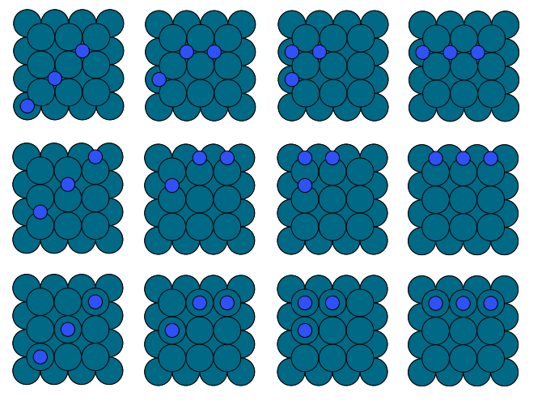

# materials_interface
## Authors

- Ryther Anderson

## Motivation
materials_interface is a Python 3 program used for automated enumeration of solid/surface/adsorbate systems for simulation initial inputs. 

## Usage
Currently materials_interface is just a collection of useful functions, probably the most useful ones are in the enumerate_adsorption.py module,
these can me used to automatically generate all possible adsorption configurations in bulk metals or on a metal surface. There are also functions 
for enumerating vacancies, generating adsorbate "paths" (e.g. adsorbates in a linked pattern), and visualization.

## Setup

I recommend making virtual environment for use with these scripts:
```
pip3 install virutalenv
virtualenv env --python=python3
source env/bin/activate
```

Then install the dependencies:
```
pip3 install requirements.txt
```

## Examples
First import the required functions and classes:
```
from grid_images import material_grid
from read_inputs import mp_query
import enumerate_adsorption as EA
import enumerate_vacancies as EV
from ase import Atoms
```

Get an example material from Materials Project (FCC Pd):
```
api_key = open('.MP_api_key', 'r').read().replace('\n', '')
q = mp_query(api_key)
m = q.make_structures('Pd')[0]
```

### Example 0, Single-Species Surface Adsorption

```
N = Atoms('N', positions=[(0, 0, 0)])
a = EA.surface_adsorption_generator(m, plane=(1,0,0), slab_depth=2)
a.make_supercell((3,3,1))
a.enumerate_ads_config([(N,0)], 3)
mat = material_grid(a.adsorbate_configuration_dict)
grid = mat.build_grid(square_grids=True)
mat.write_grid('ex0.png')
```

This builds all possible single-site (i.e. top, bridge, and hollow) configurations of a N atom adsorbed on a 3x3x1 Pd(100) surface

<p align="center">

</p>


